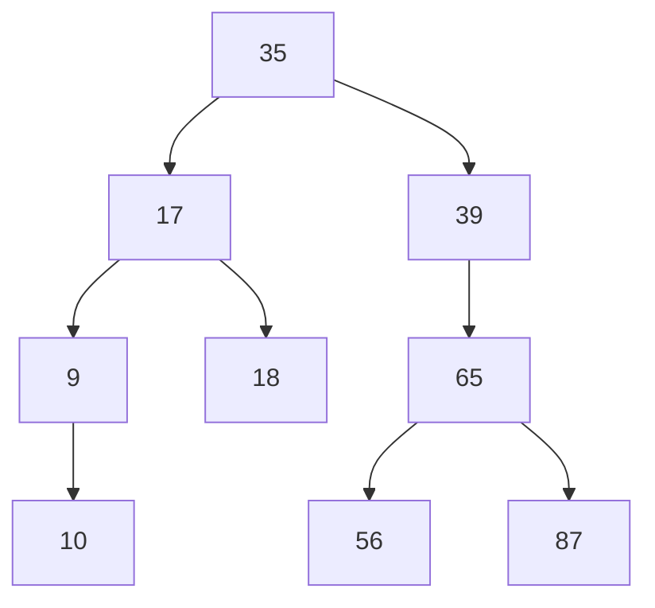
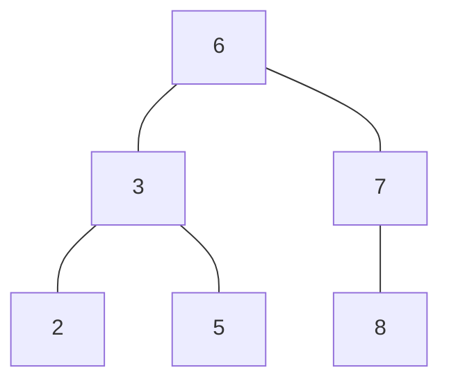

b+树来存储索引
b+树和b树的区别？

### 聚集索引
> 主键索引和行记录存储在一起的，叫做聚簇索引
### 非聚簇索引
> 存储的事主键和其他索引
> 除了主键索引外都是非聚簇索引，像普通索引，唯一索引，组合索引

> InnoDB一张表中有且仅有一个聚簇索引，
> 1. 表存在主键，主键索引就是聚簇索引
> 2. 表不存在主键，就会把第一个非空的唯一索引作为聚簇索引
> 3. 否则，隐式的定义一个rowid作为聚簇索引

### 回表查询
> 从上边的索引存储结构，我们可以看到，在主键索引树上，通过主键就可以一次性查出来我们所需要的数据，速度非常的快。  
> 因为主键和行记录就存储在一起，定位到了主键，也就定位到了所要找的记录，当前行的所有字段都在这（这也是为什么我们说，在创建表的时候，最好是创建一个主键，查询时也尽量用主键来查询）。
> 对于普通索引，如例子中的 name，则需要根据 name 的索引树（非聚集索引）找到叶子节点对应的主键，然后再通过主键去主键索引树查询一遍，才可以得到要找的记录。这就叫 回表查询
### 查询过程
 `select * from student where name='zs';`
 它需要查询两遍索引树。
- 通过非聚集索引定位到主键 id=1。
- 通过聚集索引定位到主键id为1，对应的行记录。
### 索引覆盖
> 索引覆盖，就是在用这个索引查询时，使它的索引树，查询到的叶子节点上的数据可以覆盖到你查询的所有字段，这样就可以避免回表。

### 最左前缀原则
> 最左前缀原则，顾名思义，就是最左边的优先。指的是联合索引中，优先走最左边列的索引。如上表中，name和age的联合索引，相当于创建了 name 单列索引和 (name,age)联合索引。在查询时，where 条件中若有 name 字段，则会走这个联合索引。
对于多个字段的联合索引，也同理。如 index(a,b,c) 联合索引，则相当于创建了 a 单列索引，(a,b)联合索引，和(a,b,c)联合索引。
为了验证最左前缀原则，我们需要对原来的表结构进行改造。再添加两个字段(address,sex)，然后创建三列的联合索引(name,age,address)。

> 执行计划，若不符合最左前缀原则，则 type为 index，若符合，则 type 为 ref。


- 索引，聚簇索引
- innodb底层运行原理，索引优化原理
- union连接两端查询有什么要求
- InnoDB 的行锁原理
- arraylist的扩容机制，为什么是线程不安全
- 线程不安全是什么
- 加锁的关键字，不是sycn
- arraylist和linkedlist容量什么不同
- mongodb的执行时间
- 关于内存的思考，如何创建一个高速内存组件

树的高度越低 查询越快
### 平衡二叉树
非叶子节点最多有两个节点，非叶子节点值大于左边子节点，小于右边子节点
树的左右两边层级数差值不会大于1 


### B树
平衡多路查找树 查找路径不止2个

## B+树
B+树索引的构造类似于二叉树，
> B+树中的B不是代表二叉（binary），而是代表平衡（balance），因为B+树是从最早的平衡二叉树演化而来，但是B+树不是一个二叉树。

### 二分查找法
```text
5 10 19 21 31 `37` 42 48 50 55
                
5 10 19 21 31 37 42 48 `50` 55

5 10 19 21 31 37 42 `48` 50 55
```
1. 递增排列
2. 先从中间查找，对比要查找的值48然后缩小到右半部分
3. 通过比较，将查找区间缩小一半

### 二叉查找树和平衡二叉树
> b+树是通过从二叉查找树，再由平衡二叉树，b树演化而来。


如图为 二叉查找树

二叉查找树，左子树的键值小于根的键值，根的键值小于右子树的键值。
二叉查找树是从根节点开始进行查找。
二叉树可以任意的构造，但是不同的构造，会导致查询效率不一样；最大性能的构造一个二叉树，需要这个二叉树是平衡的。

### 平衡二叉树
平衡二叉树的定义，两个子树的高度最大差为1
这就是平衡二叉树，AVL树，平衡二叉树查找性能是比较高的，但是不是最高的，只是接近最高性能。

平衡二叉树虽然查询快，但是维护起来代价很大，通常需要一次或多次左旋右旋，得到插入或更新的后树的平衡
不过在内存机构中，开销相对来说较小。

### B+ 树


