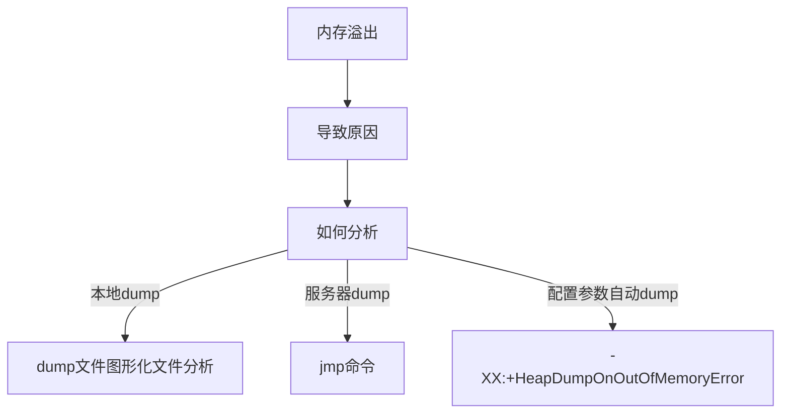
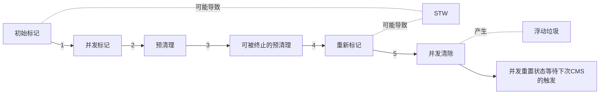

## 概念介绍
### 可达性分析
>    从一个被称为 GC Roots的对象开始向下搜索，如果一个对象到 GCRoots 没有任何引用链相连时，则说明此对象不可用。
### 引用计数法
>   给对象设置一个引用计数器，当有一个地方引用到这个对象时，就将计数器加一，引用失效，计数器减一。当一个对象的引用计数器为零时，说明此对象没有被引用，将会被垃圾回收。(无法解决循环引用问题)
### 标记清除
>   分为标记阶段和清除阶段，标记阶段标出所有引用的对象，清除阶段清除未被标记对象的空间。
    适合老年代，cms垃圾收集器采用此方式，会产生空间碎片。
### 复制算法
>    将可用内存划分为大小相等的两块，每次只使用其中的一块，当进行垃圾回收的时候了，把其中存活对象全部复制到另一块中，然后把已使用的内存空间一次性清空掉。
### 标记整理
>    先标记存活对象，然后把存活对象向一边移动，然后清理端边界以外的内存。
    老年代，不产生空间碎片，整理需要时间
### 分代收集
> 在新生代中。每次垃圾回收都发现有大批对象死去，只有少量存活，那就选用复制算法，只需要付出少量存活的对象的复制成本就可以完成回收。而老年代中因为对象存活率高，没有额外空间对它进行担保，就需要用到"标记——清除"或者"标记整理"算法进行回收。

>    大多数新建的对象都位于Eden区。
当Eden区被对象填满时，就会执行Minor GC，并把所有存活下来的对象转移到其中一个survivor区。
Minor GC同样会检查存活下来的对象，并把它们转移到另一个survivor区。这样在一段时间内，总会有一个空的survivor区。
经过多次GC周期后，仍然存活下来的对象会被转移到年老代内存空间，通常这是在年轻代有资格提升到年老代前通过设定年龄阈值来完成的。
## 垃圾回收器CMS和G1
### CMS回收器
> CMS 处理过程有七个步骤（这也是面试常问的问题，包括哪俩个阶段会STW）：
1. 初始标记(CMS-initial-mark) ,会导致STW； 初始标记阶段就是标记老年代中的GC Roots能直接关联到的对象。速度很快
2. 并发标记(CMS-concurrent-mark)，标记所有初始标记的所关联的跟可达对象，时间较长；与用户线程同时运行；因为是并发运行的，在运行期间会发生新生代的对象晋升到老年代、或者是直接在老年代分配对象、或者更新老年代对象的引用关系等等，对于这些对象，都是需要进行重新标记的，否则有些对象就会被遗漏，发生漏标的情况。为了提高重新标记的效率，该阶段会把上述对象所在的Card标识为Dirty，后续只需扫描这些Dirty Card的对象，避免扫描整个老年代；
   并发标记阶段只负责将引用发生改变的Card标记为Dirty状态，不负责处理；
3. 预清理（CMS-concurrent-preclean），与用户线程同时运行；
4. 可被终止的预清理（CMS-concurrent-abortable-preclean） 与用户线程同时运行；
5. 重新标记(CMS-remark) ，会导致STW； 这个阶段会导致第二次stop the word，该阶段的任务是完成标记整个年老代的所有的存活对象。并发标记阶段，用户操作会导致一些对象的变动；两种情况，一种是已经GC标记的对象已经死亡，这种称为浮动垃圾，下次再回收；另一种是gc线程将这个对象当作垃圾了，但是这个对象又被重新引用（可达性分析），这种就靠重新标记解决。
   这个阶段，重新标记的内存范围是整个堆，包含young_gen和old_gen。为什么要扫描新生代呢，因为对于老年代中的对象，如果被新生代中的对象引用，那么就会被视为存活对象，即使新生代的对象已经不可达了，也会使用这些不可达的对象当做cms的“gc root”，来扫描老年代； 因此对于老年代来说，引用了老年代中对象的新生代的对象，也会被老年代视作“GC ROOTS”:当此阶段耗时较长的时候，可以加入参数-XX:+CMSScavengeBeforeRemark，在重新标记之前，先执行一次ygc，回收掉年轻带的对象无用的对象，并将对象放入幸存带或晋升到老年代，这样再进行年轻带扫描时，只需要扫描幸存区的对象即可，一般幸存带非常小，这大大减少了扫描时间
   由于之前的预处理阶段是与用户线程并发执行的，这时候可能年轻带的对象对老年代的引用已经发生了很多改变，这个时候，remark阶段要花很多时间处理这些改变，会导致很长stop the word，所以通常CMS尽量运行Final Remark阶段在年轻代是足够干净的时候。另外，还可以开启并行收集：-XX:+CMSParallelRemarkEnabled。来提高这个阶段的效率
6. 并发清除(CMS-concurrent-sweep)，与用户线程同时运行；
>通过以上5个阶段的标记，老年代所有存活的对象已经被标记并且现在要通过Garbage Collector采用清扫的方式回收那些不能用的对象了。
这个阶段主要是清除那些没有标记的对象并且回收空间；由于CMS并发清理阶段用户线程还在运行着，伴随程序运行自然就还会有新的垃圾不断产生，这一部分垃圾出现在标记过程之后，CMS无法在当次收集中处理掉它们，只好留待下一次GC时再清理掉。这一部分垃圾就称为“浮动垃圾”。
7. 并发重置状态等待下次CMS的触发(CMS-concurrent-reset)，与用户线程同时运行；
### CMS回收器优化
> XX:+CMSScavengeBeforeRemark
减少remark重新标记阶段停顿，一般CMS的GC耗时 80%都在remark阶段，如果发现remark阶段停顿时间很长，在执行remark操作之前先做一次ygc，目的在于减少ygen对oldgen的无效引用，降低remark时的开销。
-XX:CMSFullGCsBeforeCompaction=n
CMS是基于标记-清除算法的，只会将标记为为存活的对象删除，并不会移动对象整理内存空间，会造成内存碎片，这时候我们需要用到这个参数;
### G1垃圾回收器
G1是一个分代的，增量的，并行与并发的标记-复制垃圾回收器。它的设计目标是为了适应现在不断扩大的内存和不断增加的处理器数量，进一步降低暂停时间（pause time）。G1将内存划分一个个固定大小的region，每个region可以是年轻代、老年代的一个。内存的回收是以region作为基本单位的；
### Full GC
Full GC：收集整个堆，包括young gen、old gen、perm gen（如果存在的话）等所有部分的模式。
当准备要触发一次Minor GC时，如果发现统计数据说之前Minor GC的平均晋升大小比目前old gen剩余的空间大，则不会触发young GC而是转为触发full GC
Parallel Scavenge（-XX:+UseParallelGC）框架下，默认是在要触发full GC前先执行一次young GC，并且两次GC之间能让应用程序稍微运行一小下，以期降低full GC的暂停时间（因为young GC会尽量清理了young gen的死对象，减少了full GC的工作量）。控制这个行为的VM参数是-XX:+ScavengeBeforeFullGC。这是HotSpot VM里的奇葩嗯

## JVM内存溢出检查流程

### CMS垃圾回收器运行流程
