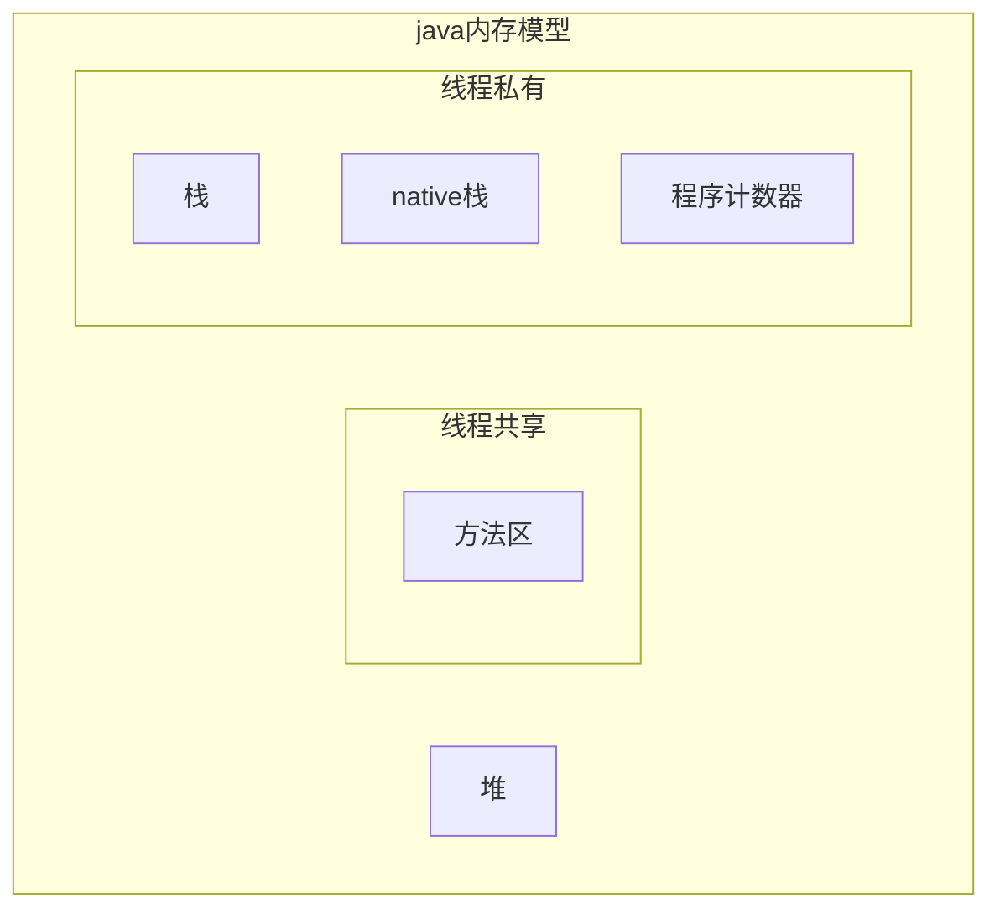
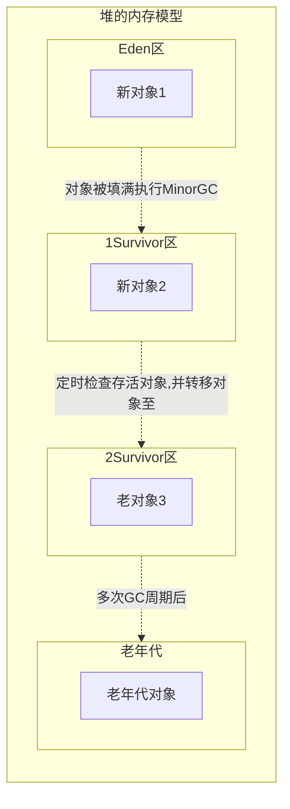

## 常见词语解释
### 局部变量
> 方法内部定义的变量
### 常量
> 静态常量：static final 修饰 ;成员常量：final修饰
### 堆
> 堆是jvm启动时候创建的最大一块内存，用于存放java对象实例，也是垃圾回收的主要区域，当内存不足时候会引发内存溢出。
### 栈
> java方法执行的内存模型。存放基本的数据类型变量、对象引用、函数调用的现场保存
### 栈帧
> 函数调用时候创建一个栈帧，存储局部变量表，操作栈，方法出口信息。
### 方法区
> 存放常量，编译后的代码数据
### 程序计数器
> 线程行号指示器
### 本地方法栈
> nvtive方法服务
## JVM基本解释
### 年轻代
#### Enden区
> 新对象产生的地方
#### Survivor区

### 老年代
> 长期存活的对象和经过多次Minor GC后依然存活下来的对象

### Minor GC
> 年轻代Enden是所有新对象产生的地方。当年轻代内存空间被用完时，就会触发垃圾回收。
    这个垃圾回收叫做Minor GC。把存货下来的对象转移到其中一个Survivor区
    年轻代被分为3个部分——Enden区和两个Survivor区
### 类加载机制
> 编译器将java文件编译成class文件（二进制字节码文件），类加载器的作用就是在用到这些class时候，将其加载到jvm中，生成对应的class对象。
### 类加载过程
> 加载-验证-准备-解析-初始化

> 虚拟机把描述类的数据从 Class 文件加载到内存，并对数据进行校验，解析和初始化，最终形成可以被
 1. 加载：加载是类加载的第一个阶段，通过类的全限定名来找到对应的class文件，将此class文件生成一个class对象。 
 2. 验证：验证的目的在于确保class文件的字节流中包含信息符合当前虚拟机要求，不会危害虚拟机自身安全。主要包括四种验证，文件格式验证，元数据验证，字节码验证，符号引用验证；
 3. 准备：给静态方法和静态变量赋予初值，比如static int a；给其中的a赋予初值为0，但是这里不会给final修饰的静态变量赋予初值，因为被final修饰的静态变量在编译期间就已经被赋予初值了；
 4. 解析：主要将常量池中的符号引用替换为直接引用的过程。
 5. 初始化：类加载最后阶段，若该类具有超类，则对其进行初始化，执行静态初始化器和静态初始化成员变量(如前面只初始化了默认值的static变量将会在这个阶段赋值，成员变量也将被初始化。
### 类加载器
> 执行以上类加载过程的就是类加载器
虚拟机直接使用的 java 类型。

系统给我们提供的类加载器有三种：启动类加载器、扩展类加载器和系统类加载器。
#### 启动类（Bootstrap）加载器
> 它是由C++实现的本。地方法，不属于Java类范畴，不能够被直接引用，主要被用于加载java所需的核心jar包，它负责将 <JAVA_HOME>/lib路径下的核心类库或-Xbootclasspath参数指定的路径下的jar包加载到内存中，属于顶级类加载器。
#### 扩展类（Extension）加载器
> 它负责加载<JAVA_HOME>/lib/ext目录下或者由系统变量-Djava.ext.dir指定位路径中的类库。
#### 系统类（System）加载器
> 它负责加载系统类路径java -classpath或-D java.class.path 指定路径下的类库，也就是我们经常用到的classpath路径，开发者可以直接使用系统类加载器，一般情况下该类加载是程序中默认的类加载器，通过ClassLoader#getSystemClassLoader()方法可以获取到该类加载器。

### 双亲委派模式
> 优先父类加载器去加载任务

类加载器在加载类的时候如果有父加载器，会优先将加载任务委托给父类加载器执行，若父类加载还有父类加载器，则进一步委托给上层的父类加载器，直到委托给顶层类加载器（Bootstrap ClassLoader），因为顶层类加载器已经没有父类加载器了。然后由父类加载器进行类的加载，若加载失败，则逐级向下由子加载器类进行加载。

> 优点:
> 1. 类不会被重复加载，父类已经加载过的类，子类没有必要再去加载一次。
> 2. 安全。 比如Bootstrap ClassLoader会加载JVM需要的核心java包，这时候网络上传来了一个名字是java.lang.Integer的类，Bootstrap ClassLoader检测到该类已经被加载过了，所以直接返回Class，而不是重新加载，便可以防止核心API库被随意篡改。可能你会想到自己在classpath路径下自定义一个java.lang.myInteger类，这并不属于java核心包中，父类加载器找不到该类，所以最后交由系统类加载器加载该类。但是这样做是不允许，因为java.lang是核心API包，需要访问权限，强制加载将会报出异常
## 关系图

### java内存模型

### 堆的内存模型
