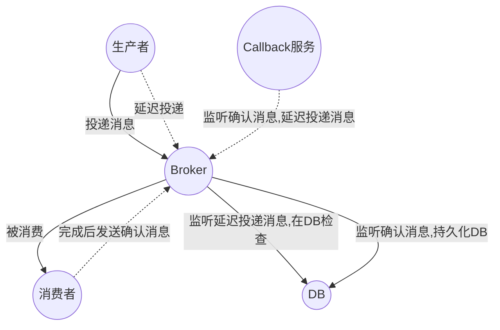

# RabbitMQ
## 基础概念
### 什么是rabbitmq
> 采用AMQP高级消息队列协议的消息队列技术，最大的特点是消费并不需要确保提供方存在，实现了服务之间的高度解耦
RabbitMQ是使用Erlang语言开发的开源消息队列系统，基于AMQP协议来实现。AMQP的主要特征是面向消息、队列、路由（包括点对点和发布/订阅）、可靠性、安全。AMQP协议更多用在企业系统内，对数据一致性，稳定性和可靠性要求很高的场景，对性能和吞吐量的要求还在其次。

### 为什么使用rabbitmq
> 消费者和生产者的解耦;异步通信性能高;流量削峰
1. 解耦
2. 异步通信性能高
3. 流量削峰
### rabbitmq使用场景
1. 异步通讯
2. 顺序消费
3. 流量削峰
4. 定时任务
### rabbitmq如何确保接收方消费了消息
> CONFIRM模式

>生产者头题消息后，如果Broker收到消息会给生产者一个应答；生产者接收应答，用来确认这条消息是否正常发送到Broker；
接收方收到消息，要同样进行确认；

- 发送方确认模式 
  
将信道设置成confirm模式，在信道上发送的消息就会被指派一个唯一的ID。消息被投递到目标队列或者写入磁盘之后，信道会发送一个确认给生产者（包含唯一id） ；如果发生内部错误消息丢失，会发送一条nack，未确认消息。

- 接收方确认模式

消费者接收到每一条消息后都必须进行确认，只有消费者确认了消息，rabbitMQ才会把消息从队列中删除。

- 特殊情况

1. 如果消费者接收到消息，在确认之前断开了连接或取消订阅，RabbitMQ 会认为消息没有被分发，然后重新分发给下一个订阅的消费者。（可能存在消息重复消费的隐患，需要去重）
2. 如果消费者接收到消息却没有确认消息，连接也未断开，则 RabbitMQ 认为该消费者繁忙，将不会给该消费者分发更多的消息。

### 消息的延迟投递，做二次确认，回调检查
> 业务落库之后，发送第一条消息，然后再发一条延迟投递消息，Broker传送到消费者，完成业务后发送一条确认消息发送给Broker；这时候有一个Callback服务一个监听确认消息，收到后进行持久化服务，同时监听一个延迟投递，收到后在db检查。  如果确认消息失败或者没有监听到那怎么办？Callback会做补偿，再发一条rpc协议到上游服务，再把这个消息发一遍。

> 确认消息失败或者没有监听到那怎么办？Callback会做补偿，再发一条rpc协议到上游服务，再把这个消息发一遍。
### rabbitmq重复消费问题
> 在消息生产时，MQ内部针对每条生产者发送的消息生成一个inner-msg-id，作为去重的依据，避免重复的消息进入队列；在消息消费时，消息体中传入一个唯一订单编号可以避免重复消费。
### rabbitmq基于什么传输
> 使用信道的方式来传输数据，信道是建立在TCP连接内的虚拟连接，每条TCP连接上的信道数量没有限制
### rabbitmq路由方式
> 这里有一个交换机的概念，消息到达exchange交换机后，根据routingkey把消息路由到与交换机绑定的队列里。
常用的交换机有：
direct：路由键匹配
topic：模糊匹配，不同源头的消息到达同一个队列
fanout：绑定到交换机的队列上
### rabbitmq如何确保消息不丢失
> 消息持久化

RabbitMQ 确保持久性消息能从服务器重启中恢复的方式是，将它们写入磁盘上的一个持久化日志文件，当发布一条持久性消息到持久交换器上时，Rabbit 会在消息提交到日志文件后才发送响应。一旦消费者从持久队列中消费了一条持久化消息，RabbitMQ 会在持久化日志中把这条消息标记为等待垃圾收集。如果持久化消息在被消费之前 RabbitMQ 重启，那么 Rabbit 会自动重建交换器和队列（以及绑定），并重新发布持久化日志文件中的消息到合适的队列。
### rabbitmq集群模式
> 镜像集群模式，创建的queue会存在多个实例上，每次写消息到queue的时候，会自动把消息到多个实例的queue里进行同步。

三个节点作为RabbitMQ的一组集群，基于镜像队列的方式保证数据100%的不丢失。前端做负载均衡，如HA-proxy组件，做到TCP级别的负载 。要想做到高可用的话借助KeepAlived做到高可用的配置。实现非常完善的高可用的RabbitMQ。

