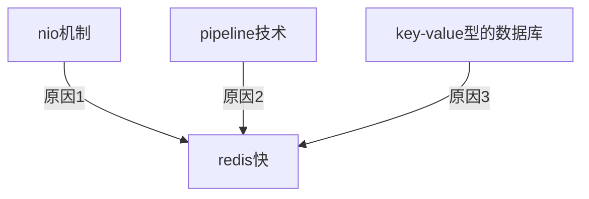

> redis 使用了 Nio机制，内部使用了专门的网络io 线程和数据操作线程
这样的 NIO 机制可以同时维护成千上万的连接数数据操作线程是单线程处理这样可以避免大量的锁开销，因为同一时刻不可能有两个数据访问的竞争同时，redis 还支持 pipeline 技术
可以将一个客户端发送过来的多个数据操作请求，放置在同一个操作队列中，统一进行处理，并返回
并且，redis 是 key value 型的数据库key 的查找使用了 hash表hash 的查询速度是非常快的类似于 hashmap 嘛当然快啊比 mysql 搜索快的多你可以把 redis 看做是一个高级的 hashmap我觉得，要是这样去回答，就是满分了

nio机制：专门的网络io和数据库线程，这样的nio机制可以同时维护成千上万的连接数数据操作线程是单线程处理这样可以避免大量的锁开销

pipeline 技术：可以将一个客户端发送过来的多个数据操作请求，放置在同一个操作队列中，统一进行处理，并返回

key value 型的数据库；key 的查找使用了 hash表hash 的查询速度是非常快的类似于 hashmap 嘛当然快啊比 mysql 搜索快的多你可以把 redis 看做是一个高级的 hashmap

