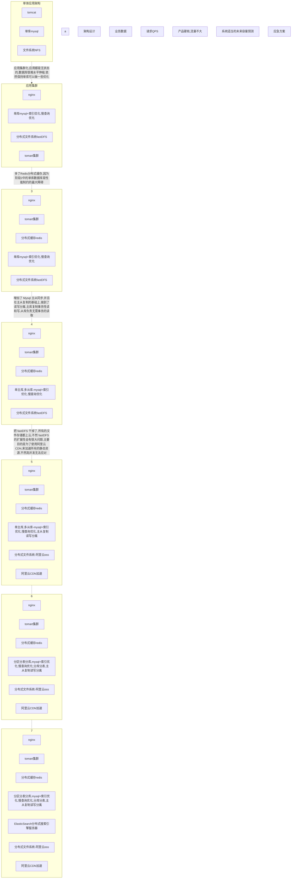

5-->6
注意，关系数据库的分片有点麻烦，很 多 NoSql 原生支持自动分片。分片技术是非常具有挑战的，对于 SaaS 在线系统来说， 我们可以根据客户来分片，或者根据地理位置分片，或者其他的 key 的哈希分片，或者 我们能够想到的任何其他方式来分片，比如用户的购买频率，用户等级等等方式来分片。 -- 相比第 5 步，增加的就是分表分库，如果单库写并发成为瓶颈，是用分片，增加多个 写，每个分片内部使用主从复制，读写分离，分片不仅仅提高了性能，还提高了高可用。如 果一个主库宕机了，其他的分片还可以接着写，无非影响的就是某一部分用户。 但是，注意，我们目前依然使用的是单体架构，没有使用微服务的，是一个单体架构，使用的数据库， 是分片数据库，这个过程中，涉及到非常多的知识,比如，分片如何路由？,分片查询如何聚 集？分片查询如何排序,分布式事务,通常来说，我们再设计分片统计的时候,都是拉到内存 中统计, 到 java 端聚合,所以，我们要杜绝大数据量的统计工作,或者说，有一些大数据量 的统计需求,我们要非常谨慎的使用分片,这些根据实际情况来设计,到这一步，基本上就是 往大型互联网公司的方向成长了,开始涉及到很多很多高级技术了。对技术人员的要求越来 越高了，基本上就是淘宝服务化之前的发展之路
6-->7
在该步骤中，封装使用统一的数据访问接口来对所 有的数据源进行访问。Nginx 也可以使用更强大的负载均衡手段，比如 F5，LVS。 -- 是不是引入了 ES 做搜索，将搜索的需求从 mysql 中抽离,Mysql 中的数据全部同步 到 ES,并且，除了 Mysql 之外,还引入了其他的 Nosql 数据库 ，根据各个不同的功能性需 求和非功能性需求,来定制化数据存储,不要什么都保存到 mysql,但是这个时候，mysql 依 然是主流,其他 Nosql 做辅助,把 mysql 不擅长做的事情交给其他 数据存储去做,将一些 非事务性的数据存储,从 mysql 移走,让 msyql 专注于事务性写的需求, 但是，我们引入了 很多的数据层,比如，mysql，redis，es，mongodb,数据访问的复杂性大大提高了,我们不可 能让程序员手工来指定这么多的数据源, 使用统一的数据访问层接口,这个怎么做呢？,我 们自己开发一些数据平台,将所有的 mysql，es，mongodb 管理起来,然后，这个平台对外提 供 API, 应用程序和数据平台 API 交互,不再直接访问物理 mysql，物理 es 服务器,这也 就是数据平台中间件,没问题
8
在该步骤中，封装使用统一的数据访问接口来对所 有的数据源进行访问。Nginx 也可以使用更强大的负载均衡手段，比如 F5，LVS。 -- 是不是引入了 ES 做搜索，将搜索的需求从 mysql 中抽离,Mysql 中的数据全部同步 到 ES,并且，除了 Mysql 之外,还引入了其他的 Nosql 数据库 ，根据各个不同的功能性需 求和非功能性需求,来定制化数据存储,不要什么都保存到 mysql,但是这个时候，mysql 依 然是主流,其他 Nosql 做辅助,把 mysql 不擅长做的事情交给其他 数据存储去做,将一些 非事务性的数据存储,从 mysql 移走,让 msyql 专注于事务性写的需求, 但是，我们引入了 很多的数据层,比如，mysql，redis，es，mongodb,数据访问的复杂性大大提高了,我们不可 能让程序员手工来指定这么多的数据源, 使用统一的数据访问层接口,这个怎么做呢？,我 们自己开发一些数据平台,将所有的 mysql，es，mongodb 管理起来,然后，这个平台对外提 供 API, 应用程序和数据平台 API 交互,不再直接访问物理 mysql，物理 es 服务器,这也 就是数据平台中间件,没问题
9
分布式微服务集群 ：在 8 的基础上，每个子系统都使用微服务改造，继续拆分系统， 使用网关，前端微服务，抽取内部的共享的下级后端微服务、辅助微服务和企业级共享中台 级服，每一个服务都有自己独立的数据库，并构建服务间调用的交互链路。 -- 9 和 8 的区别是：每一个子系统内部使用微服务,比如，京东的家具子系统团队, 内部使用微服务,京东搜索子系统，内部使用微服务,子系统比微服务级别更高,每个子系统 由微服务构成,到了 第 9 步，才是真正的微服务化 ,LVS 取代了 nginx看这个图,每个 LVS 拥有一个独立无二的 IP,代表一个子系统的入口,LVS 做负载均衡器， 负载谁啊？,是不是微服务中的网关？,网关作为微服务集群的入口,肯定不能只有一个,实 际上，网关像 tomcat 集群一样,是一个复制集,我们部署 10 个副本,相同的网关,然后让 LVS 平均分配到网关上,和 Nginx + tomcat 是一个意思,没问题吧,那前端微服务是什么意 思呢 ,
前端微服务为用户提供 API 接口，比如安卓，IOS，HTML5,Vue、,给 Vue 提供接口,这就 是前端微服务,通过网关路由到前端微服务,网关是对各个不同的前端微服务的一个聚合,前 端微服务通常都是使用 Rest,提供 Rest 接口,但是，后端微服务就不一定使用 Http Rest 了,后端为服务可以是 Dubbo,使用其他的通信协议,这个能理解吗,前端微服务直接为外部 用户提供 API ，后端微服务不直接对用户暴露，前端微服务的 API 就是用户使用的 API， 那前端微服务以什么方式提供的？node 进程？ http 服务嘛,后端可以用 dubbo,也可以用 springboot,协议可以私有。但是，一般前端微服 务（面向前端业务的服务），不可能调用到自己这里就结束了,它还要往下调用，内部的一 些服务，特别是一些共享服务！ 中台和服务又不一样了，中台服务是企业级战略层面的， 是整个公司最核心的战略级服务,比如，京东，无论是家具子系统,还是电子产品子系统,他 们都需要订单？,都需要购物车 ，这种级别的服务,是跨越多个子系统存在的,京东内部有几 百个子系统,每个子系统都有自己独立的内部服务化,但是，他们还需要共享中台级服务,中 台也挺复杂,
需不需要一个统一的平台来管理这些项目呢,从硬件层面来说，我们要统一,是不是要云计算, 上云！
10
微服务集群上云 ：在 9 的基础上，使用 docker + k8s + 云上部署 + 使用云基础设 施 + 第三方开放服务 + Serverless 架构，打造云原生应用程序。
所谓的云原生项目，就是，无论我前面 1 到 9 多么复杂,你只需要坐在电脑前面,打开网页, 点点鼠标,就可以完全的管理你的数据中心和应用集群,你没有机房,你没有服务器设备,你 只有一台笔记本电脑,你就可以打造一个超大规模的互联网数据中心,这就是云原生应用程 序,一切都是网页页面可视化的,你看到的东西都好像是虚拟的,上云之后，可以解决性能伸 缩问题 。
流量突然暴涨怎么办？ K8S 可以解决这个问题,K8S 中的 Pod 可以弹性伸缩,当 k8s 集群发现某些 pod 的资源占用率变高，超过设定的阈值, 就会自动创建新的 pod 加入到集 群中,这是全自动化的,人工也可以,然后怎么做限流？
怎么做降级,如果流量暴涨突然增大,我们要想到三板斧,第一，降级,第二限流,第三， 动态伸缩;
第一，降级的目的是什么？,把所有的资源，都让路给核心链路,其他的非核心链路全部 停下来（无关紧要的查询功能停止服务）
第二 ，限流,限流对用户体验影响很大,但是，我们要保护自己的系统,限流的目的是为 了系统不被冲垮,
第三，在限流的基础上，弹性伸缩,加机器，并加入到负载均衡器,切流量,让负载降低 ， 这是应急方式 从集群部署，到分布式缓存，到读写分离，主从复制，分表分库，Nosql，ES，消息队列异 步化，微服务，中台，云原生。 到了第 10 步之后，一个大型互联网项目，通常还有大数 据的需求
11
大数据离线分析，大数据实时统计，分布式日志处理。如果仅仅说技术，是够了,但是技术总监还需要有强大的综合能力